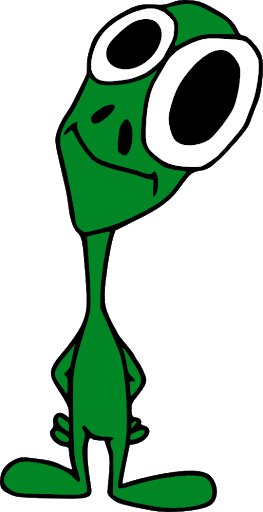
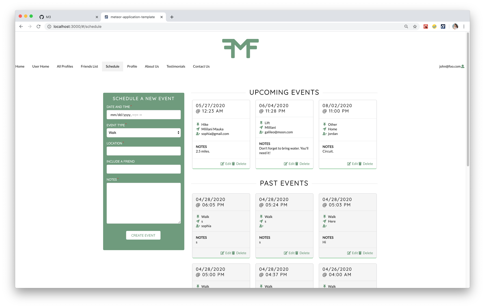

## Definitely different design (patterns!)

Suppose there is a top-secret intelligence agency called OIA (Odd Intelligence Agency) which collects data about three different topics: UFOs, cryptids, and conspiracies. This agency has two main groups of employees. The first are Researchers. Researchers file and store data. The second are Watchers. Watchers keep track of any changes to stored data. Any time the Researchers document a change in the data (say, for example, that the OIA was informed that the <a href="https://www.bbc.com/news/world-us-canada-52457805">CIA had released a report about UFOs</a> and add it to their records), they notify the Watchers that the UFO data set has changed via email. 

The agency also has a set of Clients who pay the agency for up to date information about a specific set of data. For example, a certain tabloid might ask the agency to keep them updated on only cryptids, or UFOs and conspiracies. Thus the Watchers at OIA are obligated to notify the Clients any time the Researchers make a change to the records. This means that any time the Researchers email the Watchers with an update, the set of Watchers automatically notify relevant Clients about changes to the data set they are interested in. This way, the Clients are constantly kept updated with new data — perhaps this is how they pump out so many tabloids!

## What's with the metaphor?

Jokes aside, how is this concept important in Software Engineering? It describes a Design Pattern, which is a widely agreed-upon solution to a commonly occurring problem. Specifically, it describes the Publish-Subscribe variant of the Observer Pattern. In this pattern, a “subject” object/“publisher” keeps a list of “observers” and lets them know of any state changes. Any time the subject changes state, it notifies the “event bus,” which in turn notifies any observers who care about a specific publication. In the OIA example, Researchers = Publisher, Watchers = Event Bus, and Clients = Observers.

## The metaphor, realized

In ICS 314 this semester, we’ve been working with Semantic UI + React and Meteor, a JS framework, to build a web application. Meteor is known for having a Publish-Subscribe feature which facilitates the use of collections in MongoDB. It is great for retrieving only relevant data whenever it is needed. For example, we have a “Scheduling” page (pictured right) which subscribes to an “Events” collection. The Events collection stores a set of events with certain fields (date, time, owner, etc.). We also have a Publications file in which we call on Meteor to publish all events of the current user. This way, when the Events page subscribes to the Events collection, it receives the necessary information only. This is much like a Client who asks the Watchers in the OIA to see only relevant information; if he subscribes only to UFOs, he won’t receive information about conspiracies or cryptids. Further, just like said Client would receive any updates to the UFO data collection instantaneously, the same can be said for the Scheduling page. If the Events collection is updated, the Publication-Subscribe model ensures that the Scheduling page will know this.

This has been a very useful Design Pattern to get acquainted with in Meteor. I hope to use it more in the future.
