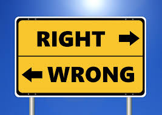
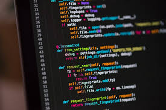

## (Software) Engineering Ethics
Since software engineering is a relatively new field with what seems like comparatively little impact on life, it’s easy to dismiss the ethical obligation that software engineers have. But our society becomes more reliant upon technology with each passing day, and with this upward trend grows also the need for ethically trained software engineers. 

Some of the more pressing issues that come to mind when I think of ethics and computers are self-driving cars and voice technology. For the former, cars are dangerous to begin with—they’re hunks of metal which weigh thousands of pounds and can kill in an instant. For the latter, voice technology is always on in some households and it makes one wonder how much data is gathered. For topics like these, and countless others, ethics is vital in the curriculum of prospective software engineers.

So what are ethics for software engineers? There are a technical set of guidelines at the <a href="https://www.acm.org/code-of-ethics">ACM Code of Ethics</a> and the <a href="https://www.computer.org/education/code-of-ethics">Software Engineering Code of Ethics</a>, but I have my own “gut feeling”-based definition of ethics. To me, ethics has to do with ensuring the safety of the most vulnerable stakeholders. There will always be more influential stakeholders (e.g. managers, company owners) who might try to undermine the needs of the more vulnerable, and this can pose an ethical dilemma.

## Case Study: The code I’m still ashamed of
<a href="https://www.freecodecamp.org/news/the-code-im-still-ashamed-of-e4c021dff55e/#.tsjl7lkxy">This article</a> presented me with one of my worst fears. The prospect of inadvertently or ignorantly evaluating a situation such that I become responsible for the injury or death of someone terrifies me. In the case of this article, a software engineer was hired to build a website which promoted the use of a drug through questionable practices and led to the deaths of many young girls. 

It is easy to argue that the engineer was less culpable for the deaths of these girls than the company who produced the drug and hired him, but when it comes to death, what does it matter if one plays a large or small role? Any role at all is unacceptable.

In this case, the author of the article was just too young or ignorant to realize he was doing something wrong, and the company was essentially bribing him (through fancy steak dinners) to keep quiet about it and continue working for them. It’s terrifying to think of companies manipulating people this way, and the amount of guilt the author had to bear for his whole life. But these types of things do happen, and this is why ethical training is important.

I am happy that the author chose to resign from the company. Although it is upsetting that he didn’t stop what he was doing in the first place, he didn’t know what he was doing. But this just shows the importance of training students of software engineering in ethics before releasing them into the job market, so they can’t be so easily manipulated by large corporations who take advantage of both their customers and their employees. 

## The code I will never be ashamed of
I hope that, if I encounter a similar dilemma in the future, I will be able to recognize the ethical dilemma I am in. I promise myself to never pursue money over morals and to do what is in everyone’s best interest. I never want to look back and remember that I may have been privy to the physical/emotional injury or death of stakeholders. Instead, I want to be proud of the code that I write, in that it is not only innovative, but undoubtedly ethical.
