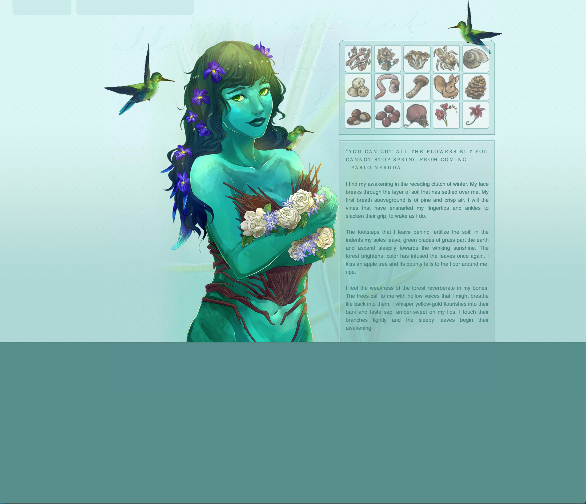
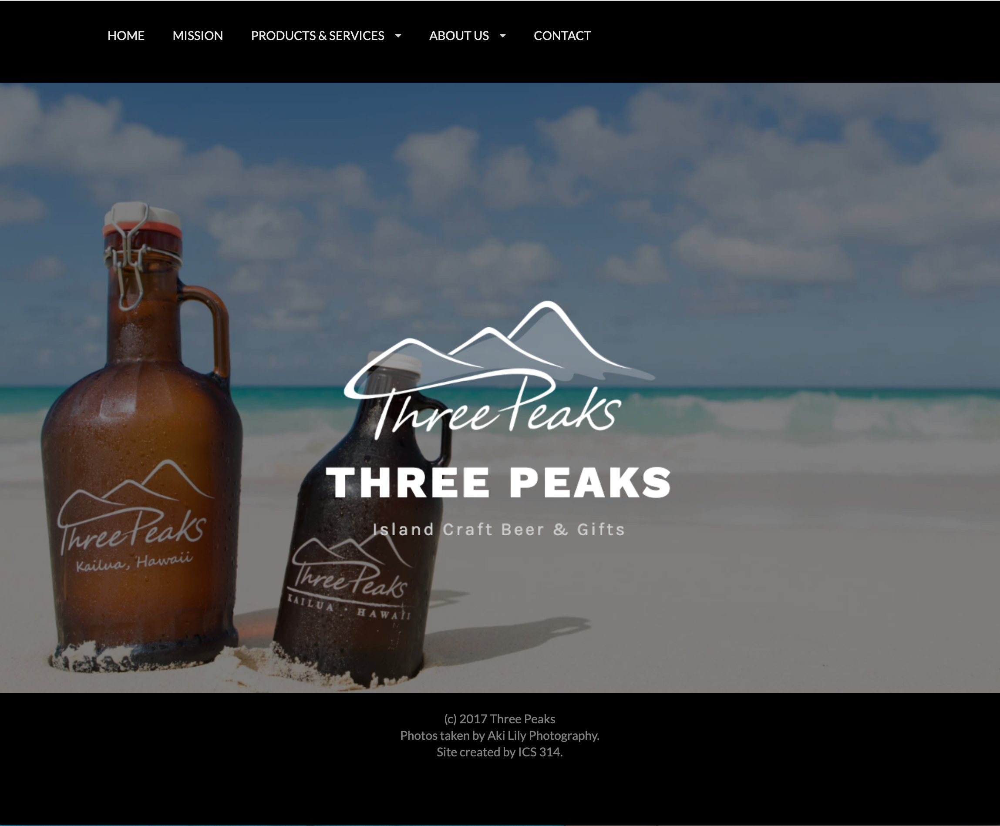
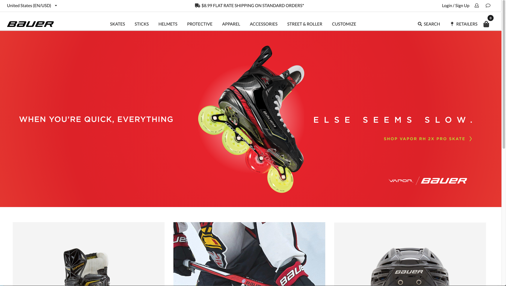

## Introduction

This week, in my Software Development class, we worked on a module on UI Frameworks. Specifically, we learned how to use Semantic UI (or at least some of it -- there's a lot to know). I'd never heard of UI Frameworks before, so I was intimidated by the module, especially the assignment that required us to watch 3-4 hours of tutorials on Semantic UI. However, I'm a sucker for UI! I enjoy making aesthetically pleasing, intuitive web page. As I mentioned in a previous essay, I have some experience with CSS/HTML, but it's mostly limited to absolute positioning over a very large background image I created in Photoshop to place text, hovers, and dropdown tabs where I wanted them to go.

## Semantic UI: The Learning Process
As you might guess from the mention of the 3-4 hours of tutorials, learning a UI Framework requires a significant upfront investment of time, and with that investment you'll only scratch the surface of proficiency with Semantic UI. But it's a very wise investment: knowing Semantic UI, or another UI Framework, will vastly improve your efficiency in building webpages using an intuitive, minimalistic approach to HTML.

## The Old Way

As I mentioned, my experience with HTML/CSS is extremely painstaking. In the past, it would take me hours to construct a web page using absolute positioning and a lot of redundant code. I would tweak the location of each text box pixel by pixel by refreshing the target page over and over. It was truly an agonizing way to work, but that's not the only issue. I became so accustomed to coding in this archaic way that I was unsure of my abilities to create design elements using HTML so I relied on graphics in Photoshop to do the work. All in all, to create a web page like the one pictured, it would take me approximately 6 hours: 4 for the background graphic, tweaked to "perfection," and another 2 for using CSS to position elements on the right place. Something I realize now that is a grave mistake for the resulting web page is that it was not mobile responsive! This is one of the most valuable things about Semantic UI, as I'll elaborate on later.

## The New Way
Using Semantic UI over the past week has really opened my eyes to the power of UI Frameworks. Semantic UI has cut the time it takes me to create a gorgeous, clean layout exponentially. It has also made the entire process much more enjoyable with its intuitive 'natural language' feature.

What at first seemed like a large investment of time to learn about the various components, views, and collections in Semantic UI actually pales in comparison to the time I'll save using Semantic UI to create a web page instead of my old process. Now, instead of taking six hours for one page, I can (for example) create a clean, aesthetically pleasing mock-up of a company's homepage in twenty three minutes for an in class exercise (pictured right). Furthermore, the confidence I've gained from being able to create a professional-looking site instead of spending hours making a giant background image in Photoshop is invaluable.

## Moving Forward

For another assignment, we were instructed to mimic a homepage of our choosing. I chose to create Bauer's homepage and was astounded to see how closely I could recreate it in just a couple hours! While brainstorming websites to recreate, I also considered mimicking the homepage of my boyfriend's dad's surfboard shaping business (I decided on Bauer instead because it was more complex -- apparently I am a glutton for punishment?). But after seeing how easy it was to recreate Bauer's page, I'm excited to undertake a new project, and hope to revisit my boyfriend's dad's homepage in the future. What is so exciting about Semantic UI is that you can look at a multitude of different homepage for major companies and say, hey, I could recreate that in a couple hours! It's an exciting, empowering feeling -- like unlocking some secret.

## Standout Features

Semantic UI has so many amazing features that make web development a breeze, but I'll focus on some of my favorites below.

### Mobile Responsiveness

Semantic UI makes mobile responsiveness amazingly simple. By simple I mean adding a single word to your div class. For example, if you're building a menu for your homepage, and you want to make the menu mobile-friendly, you simply add "stackable" to the div class, and the menu stacks at mobile breakpoints. This amazed me. As more people access the internet from their mobile devices, it's becoming increasingly important to make sites mobile friendly, and this feature of Semantic UI makes it so easy.

### Ease of Use
The same ease of use goes for many other features. Semantic UI is remarkably efficient, and actually makes sense when you read it. For example, if you want to create a black menu with white text instead of the default white menu, Semantic UI is there to save the day. You have options: you could do it the hard way, which entails adding multiple lines to your CSS: the selector, the background color, and the text color. But it would be smarter to do it the easy way: simply add "inverted" to your menu div class and it changes the background and text color of your menu. You also might notice that the inverted black elements are not a flat black, but rather a very dark grey, which elevates the design of your site.

I truly believe UI Frameworks is a game changer. I'm excited to use it in the future to create gorgeous websites with much more intuitive HTML and CSS than I have made previously. 
