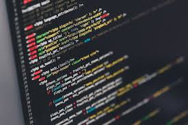
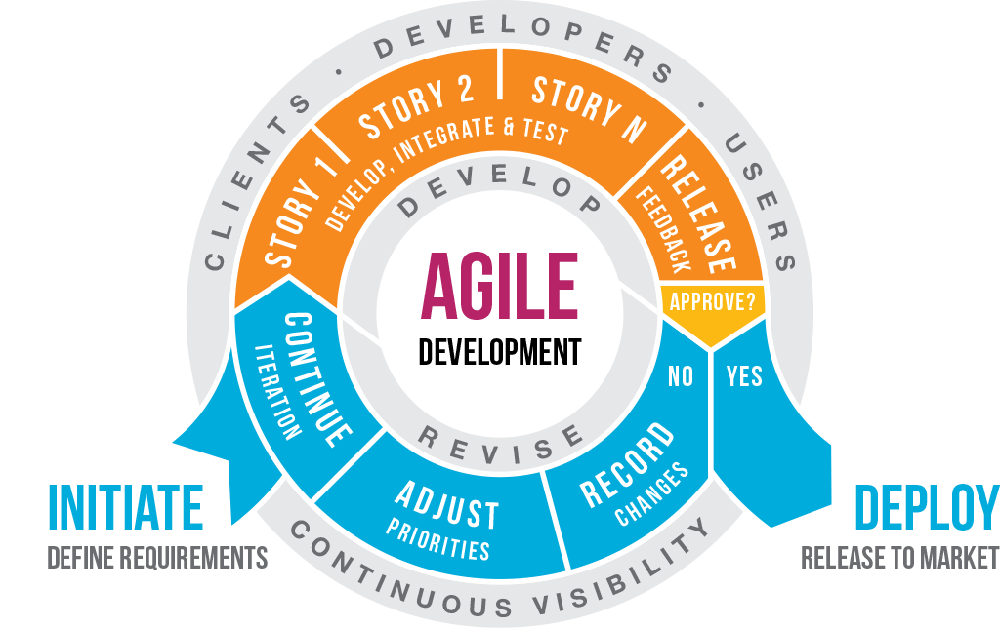

## SE & Beyond

In ICS 314 this semester, we learned a lot about Software Engineering fundamentals. Some things were easy to grasp (the importance of Coding Standards will forever be stuck in my head) and some weren’t (Design Patterns will haunt me forever), but I always took away something valuable. My favorite modules were Agile Project Management and User Interface Frameworks. I feel that these are the modules which will really shape how I move forward as a Software Engineer. Using both Agile Project Management and User Interface Frameworks showed me ways to be more efficient, skills I can use beyond web app development.

## Agile Project Management

APM is a method that makes large projects easy to handle by breaking them into small pieces. For our Final Project in ICS 314, our groups used IDPM (Issue Driven Project Management), a type of APM. IDPM organizes group web application development using the following guidelines:

* Meet 2x/week to discuss and manage project
* Break work up into 72 hour tasks
* Create a GitHub issue for each task
* Create a branch for each task; perform work for that task only in specified branch
* Use a system of milestones to create a “deliverable” version of app every 7-14 days

IDPM turned out to be incredibly useful. At first, I was confused about how we would coordinate our changes and commits. Creating branches off master for small tasks made this a non-issue because each task could be merged into master in a short enough amount of time that master wouldn’t be too many commits ahead. Our group ended up meeting more frequently than two times a week, which kept us even more organized; I can’t imagine meeting less than the specified two. Using IDPM milestones also ensured that our app functionality always remained a priority.

I can absolutely see myself using a system like this again in the future, even for other types of projects. The system of creating branches for small tasks can be applied to projects other than web apps. Further, the way IDPM specifies managing tasks (i.e., breaking them into short-term issues) makes them easily digestible and keeps progress moving. Breaking a project into incomplete but functional milestones is something that could be universally useful to ensure a project doesn’t lose functionality as things are implemented. Something I also found very useful was GitHub’s project board feature, which used a kanban system to organize tasks into categories.

Overall, I took away great time management and organization skills from the APM module that will be useful to me for future projects, whether they be web applications, other kinds of software engineering, or even group projects for other courses.

## User Interface Frameworks
To make an aesthetically appealing website, we had to learn about UI Frameworks before diving into APM. We used Semantic UI, a framework which uses “human-friendly HTML” to create visually pleasing layouts. A framework is like a library, which contains code that you can re-use.

Since my knowledge of HTML and CSS was accrued over years of “self-teaching” and poking about on websites I didn’t really understand to create abominations out of raw HTML and CSS, Semantic UI was like a dream come true. It was so easy and fast to learn. One of our first assignments was to replicate the home page of a site of our choice. It took me only a few hours to create something nearly identical to the one I chose. Now, when I see most retail websites, I wonder if they were created using Semantic UI - they all look so similar (albeit nice)! 

I was actually skeptical of using Semantic UI at first. It seemed too easy and I felt like I was cheating somehow. But as time went on, I realized what a fantastic tool it is. Imagine (as for my assignment) replicating any retail website’s homepage in just a couple hours, but without using a framework — if that isn’t impossible, it would certainly be miserable! Frameworks are a great way to create amazing, responsive layouts while saving vital time for the backend of a web application. Throughout the process of our final project, I realized that the data aspect (testing, creating data models, etc.) sucked up so much time, it would have been impossible to create something both nice and functional without a framework by the deadline. The less time we spent fiddling with “human-unfriendly HTML,” the better and more functional our site became.

Because Semantic UI is meant for web apps, I can’t really take it with me to projects outside of that. However, there are many other frameworks that exist. Most importantly, the UI Frameworks module taught me to appreciate the tools that other people have worked hard to develop for my convenience and efficiency. After all, a pretty app means nothing if it doesn’t work! I’ve definitely learned to appreciate frameworks and will make use of them or something similar for other kinds of projects in the future.

Overall, I've learned a lot in ICS 314. I feel that all the concepts we've covered have been valuable to me so far and will continue to be valuable to me as I improve as a software engineer.
