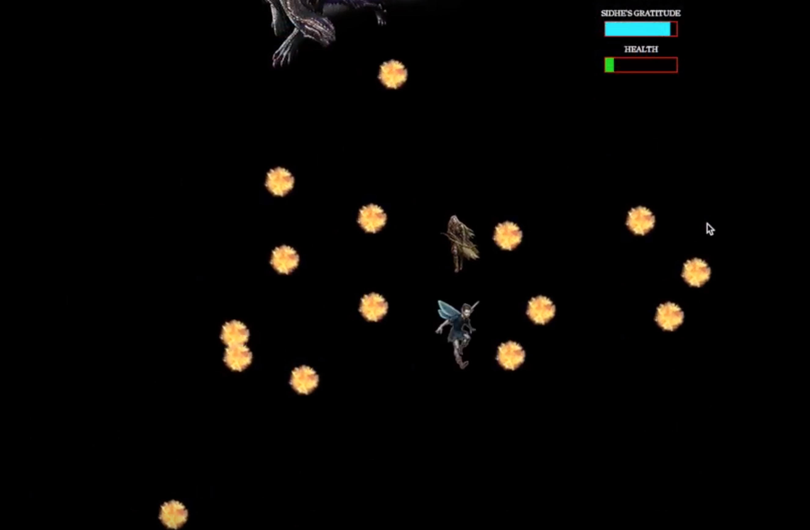

This game was my second project in my first programming class, ICS 111. The prompt was to make a game with "AI" that chased you around, but you could make portals that would teleport enemies into a boxed-in area.

The premise of my game is that you are a pixie trying to save another mythical race, the Sidhe, from certain demise (the Banshees). I was able to satisfy the prompt in the first level of my game and decided to expand on the mythology I had created by making two other levels. In an improvement on my first project, in which the character was controlled by clicking on buttons, I implemented WASD keyboard controls.

Perhaps the most important takeaway from this project was the fact that I was able to create my first kind of "AI," randomly moving enemies that would chase the character around if it came within a certain proximity of them. I also learned how to create walls/barriers. My biggest challenge for this project was making the Banshee in level two spit fireballs that went in random directions at random speeds, and in doing so making the level neither too easy nor too hard. Also, the health bar was surprisingly difficult to implement, as I remember constantly struggling with keeping it in place.

<a href="https://youtu.be/G6eainuiNng"><i class="large github icon"></i>View the Sidhe's Labyrinth Demo on Youtube</a>

<a href="https://github.com/s-rathyen/sidhes-labyrinth"><i class="large github icon"></i>View the Sidhe's Labyrinth Repository</a>
