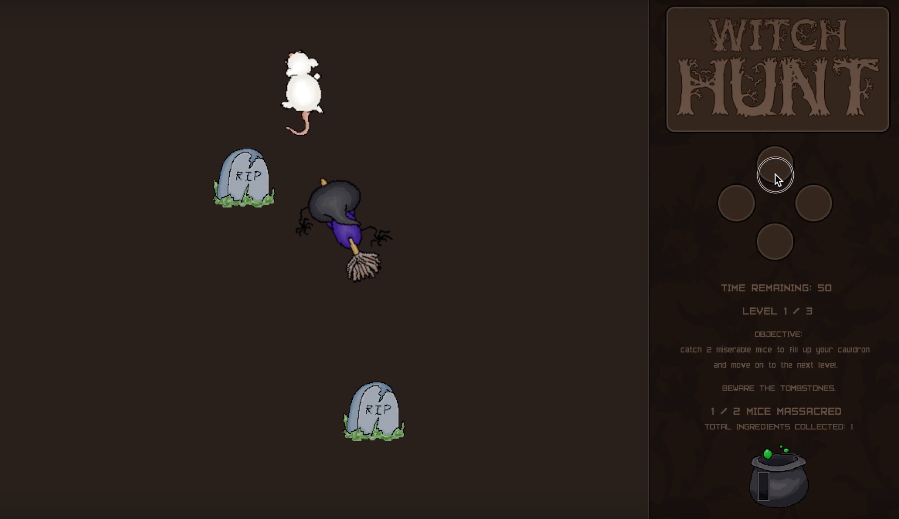

<a href="https://manoafitnessfinder.github.io/"><i class="large github icon"></i>MFF Project Page</a>

<a href="https://github.com/manoafitnessfinder/app"><i class="large github icon"></i>MFF Repository @ GitHub</a>

## Manoa Fitness Finder: Overview
(pic of logo)
MFF is a web application that allows users to input their fitness interests and goals, find others with similar
interests, log events, and join events that friends have posted. It is meant to allow college students to find
other people to work out with to keep them motivated and keep the freshman fifteen off.

## My Contributions
My biggest contribution to the site was implementing the "My Events" page. This required me to 

## My Takeaway
