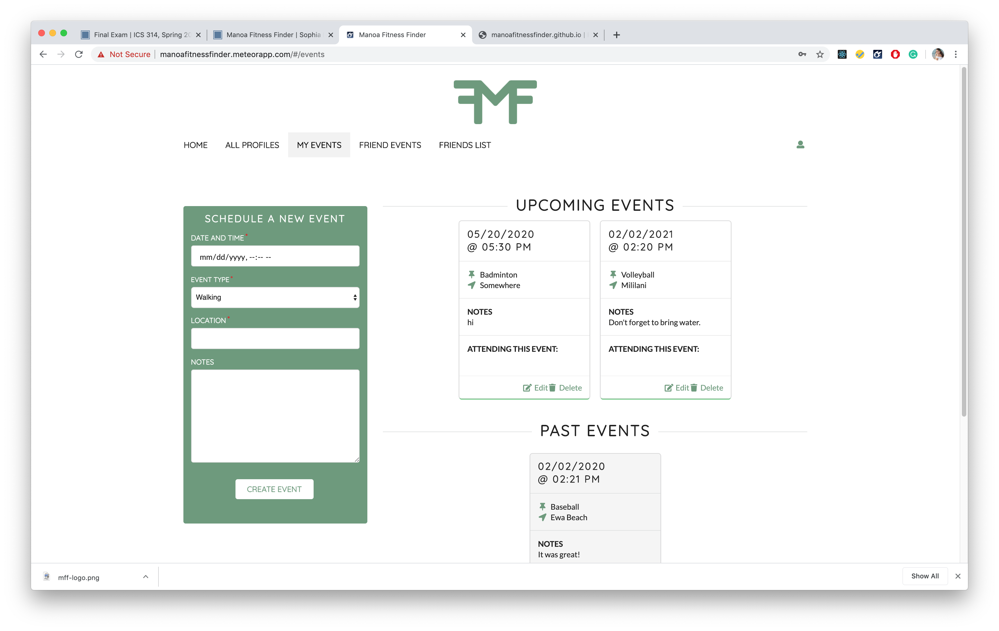
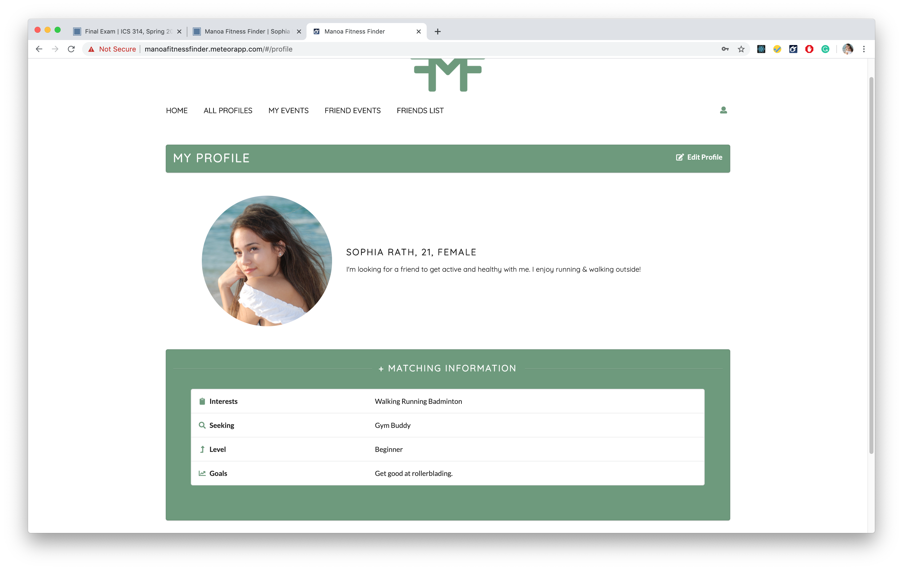

<a href="https://manoafitnessfinder.github.io/"><i class="large github icon"></i>MFF Project Page</a>

<a href="https://github.com/manoafitnessfinder/app"><i class="large github icon"></i>MFF Repository @ GitHub</a>

## Manoa Fitness Finder: Overview

Manoa Fitness Finder is a web application that helps college students stay motivated with their fitness goals. The site functionality
includes:
* Users can input their fitness interests, goals, and what they are seeking
* Users can find others, view their profiles, and add them as a friend if their interests align
* Users can comment on each other's profiles to connect and plan workouts
* Users can schedule workouts using the 'events' tab; the events are organized into past/future
* Users can join events that their friends have created
Our site facilitates making fitness connections so students can have a gym buddy, running partner, or friend to
help them stay on track and achieve their fitness goals.

## My Contributions

I'm most proud of the work I did on the Event cards. I organized and created the cards as the basis for the 'My Events'
page. First, I had to create a new Events collection. Then, I created a scheduling sidebar using Autoforms. This
allows users to create a new Event, which will then be stored in the Events collection. Creating this sidebar was
more work than anticipated. In order to be able to organize user Events into past/future, I had to use the 
"moment.js" library to use dates and times. This made the page and Events feature more user-friendly. That was my
first venture into using packages, which I'm glad I learned how to do!

Once the scheduling sidebar was finished, I moved on to organizing the Events into two categories, past and future.
This required me to fetch Events from the collection by date. I also had to work with two different timezones
and ensure everything worked correctly.

Other than the Event cards (which are used on multiple pages -- My Events, Friend Events, User Landing), I also 
helped to design and tweak the site appearance and user interface. I made sure that colors, buttons, fonts, and cards
all looked visually appealing and presentable. I also was in charge of designing the user profile pages and the edit
pages for user profiles and Events.

## My Takeaway

I really enjoyed working on Manoa Fitness Finder. My most important takeaway was probably learning about 
MongoDB Collections. I had to learn about subscriptions and fetching things from collections. These were the most
confusing and time-consuming parts of the project. I'm happy that I was able to contribute to a major part of the
backend for the site rather than focusing only on appearance, which I have prior experience with.

I also learned about Issue Driven Project Management (see my essay, "What My First Web App Taught Me" for more info)
and how useful it is for managing software projects with a small team. It took a lot of coordination and communication
to ensure that all of our tasks were completed and merged smoothly, always maintaining functionality. We couldn't
have done it without following IDPM guidelines.

This was my first software engineering group project. It was more challenging than I had anticipated, but everything
turned out really well. I feel well-prepared for more group efforts in the future having now experienced working
with a small team, and look forward to doing similar things in the future!
